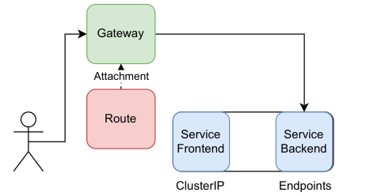
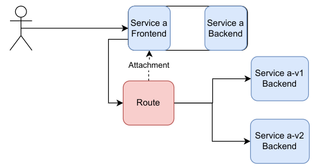

# GEP-1324: Service Mesh in Gateway API

* Issue: [#1324](https://github.com/kubernetes-sigs/gateway-api/issues/1324)
* Status: Provisional

## Overview

Gateway API represents the next generation of traffic routing APIs in Kubernetes. While most of the current work for Gateway API is focused on the ingress use-case, support for service mesh implementations within the spec would be advantageous to the greater community. Therefore, this GEP serves as the genesis for developing common patterns for using Gateway API for east/west traffic within a mesh implementation.

## Goals

* Augment the Gateway API specification with the necessary models, resources, and modifications so that the xRoute primitives are usable by service mesh implementations
* Make sure that Gateway API ingress implementations can coexist and interoperate with mesh implementations
* Remain agnostic as to the topology of mesh implementations’ data planes (i.e sidecar vs. non-sidecar)
* Enable mesh implementations to have vendor-specific extensions for their own policies, etc, in line with existing extensibility offered by Gateway API
* Cooperate with the greater Gateway API community on shared patterns/policies that are applicable for both use-cases (e.g. authorization policy)
* Maintain the integrity of the namespace boundary for traffic routing and policy, making explicit those instances where users define exceptions

## Non-Goals

* Represent every service mesh feature within Gateway API
* Duplicate concerns for the sake of “mesh-specific” resources
* Overload existing Gateway API mechanisms when a new mechanism is more appropriate
* Preemptively standardizing arbitrary policy attachment resources
    * Will instead let these policies stay vendor specific and move for standardization once a pattern emerges organically
    * N.B - vendors who implement common policies should strongly consider [namespacing](https://github.com/kubernetes-sigs/gateway-api/discussions/896#discussioncomment-1440319) their resources. More guidance to come

## Versioning

Features or other modifications to the Gateway API spec that fall under this GEP will be subject to the same [versioning guidelines](https://gateway-api.sigs.k8s.io/concepts/versioning/#graduation-criteria) as the rest of the Gateway API. For example, to move changes concerning a beta feature (e.g. HTTPRoute) from experimental to standard, all of the [beta criteria](https://gateway-api.sigs.k8s.io/concepts/versioning/#experimental-standard) must be met (e.g. implemented by several implementations).

## Use-Cases

These use-cases are presented as an aid for discussion, and as frames of reference for how users may attempt to utilize the outputs of this GEP. They are not an exhaustive list of features for mesh support in Gateway API nor does a particular use-cases inclusion necessarily imply that it is a goal.

1. As a service producer…
    1. I want to deploy a canary version of my application that splits traffic based on HTTP properties.
    2. I want to change the behavior (such as timeouts, retries, header manipulation) of my application through configuration, rather than modifying my application.
    3. I want to apply authorization policies, using client identities and/or HTTP properties.
    4. I want to collect HTTP metrics for my application without modifying my application.
    5. I want to run a mix of protocols (HTTP, TCP, TLS, gRPC, …) within my application.
    6. I want to be able to gradually opt-in to a mesh (no mesh, L4 only, L7 enabled) so I can choose the right fit for my application's performance and compatibility goals.
    7. I want to define access policies for my service
2. As a service consumer…
    8. I want to change the behavior (such as timeouts, retries, header manipulation) when my application connects to services through configuration, rather than modifying my application.
    9. I want to collect HTTP metrics for services I connect to.
    10. I want to be able to connect to Kubernetes Services and external services.
    11. I want to override the destination of my traffic, for example, to send requests to external services to an internal replica, or to send all requests to an egress proxy.
3. As a mesh administrator…
    12. I want to enforce that all traffic within my cluster is encrypted.
    13. I want to have strict isolation and control at namespace level, so a bug/malicious user can't impact other namespaces
    14. I want to be able to allow app owners to gradually opt-in to a mesh (no mesh, L4 only, L7 enabled) so they can choose the right fit for their applications’ performance and compatibility goals.
    15. Since mesh can be multi-tenant and hosting multiple services (e.g. foo or bar), as a mesh administrator I need to make sure a client can discover different services. Here are few possible ways
        1. Each service is allocated a unique IP and port
        2. Or Each service must use unique Host name
        3. Or a unique port and protocol,  (80:http, 443 tls)

## Glossary

When discussing design, it's helpful to have a shared vocabulary on the various relevant concepts. Many of these terms are highly overloaded or have many different meanings in different communities; the goal here is not to make any new standards or definitions, but rather to ensure readers are on the same page with important terms.

### **Service Mesh**

This is both core to the design and highly overloaded. Many folks have wildly different views of what "service mesh" means, and emotional responses to the word. For the purposes of this document, a "mesh" just means some component in a cluster that is capable of adding functionality to users network requests. The Gateway API for ingress traffic has been described as something that translates from things without context (outside of the cluster) to things with context (inside the cluster). Similarly, a service mesh could be described as something that uses that context to modify cluster network requests.

This is intentionally broad - while most see a service mesh as "userspace sidecar proxies using iptables to redirect traffic", this document doesn't depend on this narrow definition, and includes architectures such as [Kubernetes itself](https://speakerdeck.com/thockin/weve-made-quite-a-mesh), ["proxyless" architectures](https://cloud.google.com/traffic-director/docs/proxyless-overview), and more.

#### Scope of Functionality

For the purposes of this feature, targeted service mesh functionality is limited to the following:

1. Traffic routing (e.g. traffic splitting)
2. Traffic encryption
    1. Note that the implementation details of traffic encryption (e.g. mTLS, WireGuard) are out of the scope of this GEP. No specific implementation will be assumed.

### **Policy**

Policy is a broad term for any resource that can attach to another resource to configure it. This is defined in the [Policy Attachment GEP](https://gateway-api.sigs.k8s.io/geps/gep-713). Examples of (hypothetical) policies could be resources like `TimeoutPolicy` or `AuthorizationPolicy`.

### **Routes**

Routes are a collective term for a number of types in gateway-api: `HTTPRoute`, `TLSRoute`, `TCPRoute`, `UDPRoute`, etc. In the future there may be more defined, in core or extensions (such as `SQLRoute`).This document focuses on routes, rather than "Policy", as these are the primary existing core resources in gateway, and help form a foundation for policy attachment. Future work from GAMMA will likely look into policies, such as authorization policies.

### **Service**

"service" is a key component to meshes. In general mesh parlance, the term “service” represents an arbitrary cluster of related workloads accessible via the network as a single entity. In a Kubernetes world, this compute can be a typical `Service`, but it can also be something like a `ServiceImport` (from the MCS spec), or a custom type (a made up example would be a `CloudService` abstracting cloud endpoints). Due to the naming overlap with the Kubernetes `Service` resource, it becomes necessary to use more precise terms when describing these concerns, reserving `Service` exclusively for the Kubernetes resource.

While a `Service` in Kubernetes is a single resource, logically it handles two different roles - a "**service frontend**" and "**service backend**".

  <figure style="display:inline-block;float:left;text-align: center; width: 50%;">
    
    <figcaption>Resource level view of Service</figcaption>
  </figure>
  <figure style="display:inline-block;float:left;text-align: center; width: 50%;">
    
    <figcaption>Decomposed view of Service</figcaption>
  </figure>

 

The "service frontend" refers to how we call a service. In a `Service`, this is an automatically allocated DNS name (`name.namespace.svc.cluster.local`) and IP address (`ClusterIP`). Not all services have frontends - for example, "headless" `Service`s.

The "service backend" refers to the target of a service. In `Service`, this is `Endpoints` (or `EndpointSlice`).

In the Gateway API today, `Service` is used as a "service backend". For example, in a route we would refer to `Service` as the (aptly named) `backendRef`:

A user connecting to a Gateway, which has a Route forwarding to "Service Backend"

However, there are other ways that services _could_ be used in the API by utilizing the "service frontend".

Below shows a hypothetical way to model splitting calls to the `a` service frontend to backends composed of `a-v1` and `a-v2` (see [real world example](https://linkerd.io/2.11/tasks/canary-release/)). In this case, service is used as both a frontend and a backend. The route attaches to "Service a frontend", and any calls to that will be directed to the `a-v1` and `a-v2` backends (as determined by the logic within the route.

A user connecting to a service (frontend), which has a Route forwarding to two different services (backends)

### **Producer** and **Consumer**

A service **Producer** and service **Consumer** describe the two roles in a mesh.

A service **producer** is someone that authors and operates a service. Some example actions they may take are deploy a `Service` and `Deployment`, setup authorization policies to limit access to their workloads, and setup routing rules to canary their workloads.

A service **consumer** is someone that utilizes a service by communicating with it. For example, they may want to take actions like `curl hello-world` in their application - we could call this "consuming the `hello-world` service".

Consumer and producer are personas, not concrete workloads or resources. One important aspect of these personas is that they may live in different trust boundaries (typically namespace).

## Deferred Goals

These are goals that we aren’t explicitly excluding, but will reconsider at a later point in time

* Service mesh activation/enrollment (e.g. sidecar injection, namespace enrollment)
* Egress (e.g. off-mesh destinations including legacy services or third-party APIs)
* Multicluster use-cases (e.g. Kubernetes MCS or cluster federation)
* Heterogenous deployment targets (e.g VMs, serverless)
* Deployment models (e.g. installation, mesh upgrades)
